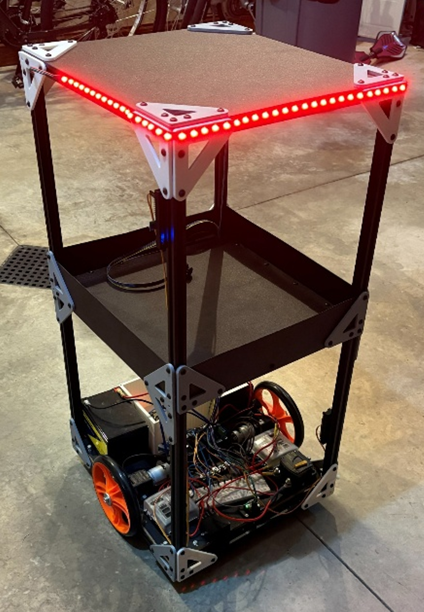
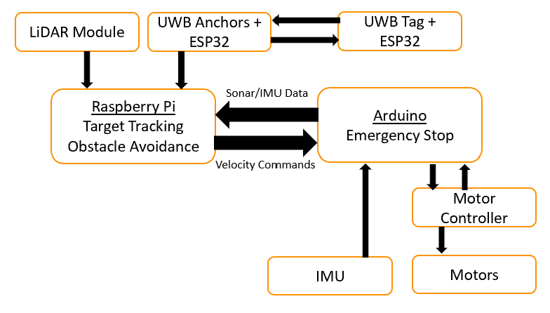
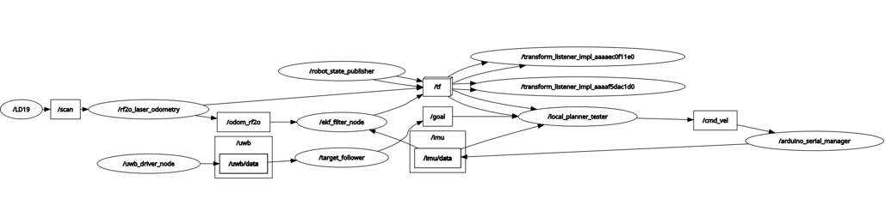

# Companion Trolley
An autonomous follow-me trolley designed to carry equipment while following a user. The robot estimates the user's position using Ultra-Wideband (UWB) localization and performs motion control using ROS 2.

## Overview

The Companion Trolley is an autonomous mobile robot designed to transport tools or other equipment while following a designated user.

The project combines:

- Ultra-Wideband (UWB) localization for user tracking
- LiDAR-based obstacle detection (not implemented in final design)
- ROS 2 for high-level navigation
- Arduino-based motor control
- Raspberry Pi for onboard computation

Primary goals:

- Safely follow a user
- Carry equipment
- Operate autonomously after power-on
## Hardware
### Image of Robot


### Computing

- Raspberry Pi 4
  - Runs Ubuntu 24.04
  - Runs ROS 2
  - Processes LiDAR, UWB, and IMU data
  - Computes navigation commands

- Arduino Mega
  - Controls motors
  - Drives LEDs
  - Interfaces with low-level hardware

### Sensors
- UWB modules equipped with dw1000 radio module and an ESP32
- LDROBOT STL-19P 2D 360-degree LiDAR
- Adafruit 9-DOF IMU
### Mechanical
- Standard 2020 aluminum extrusion v-rails
- 12–24 V, 200 W 775 DC motors
- Two 12 volt batteries
- Automotive breaker box

## Software Stack
- ROS 2
- Python
- C++
## System Architecture
### Hardware connections


### ROS 2 node connections

## Environment Setup
### VM Linux Machine
- Ubuntu 24.04
- ROS 2 Jazzy (desktop install)
### Windows 11
- Platform IO
### Raspberry Pi 4
- Ubuntu 24.04
- ROS 2 Jazzy (base install)

## Build & Run Instructions
### Software setup
Use Serial line to connect Arduino to Raspberry Pi
#### Arduino
1. Clone this repository onto computer
2. Navigate to the [arduino_controller](/firmware/arduino_controller/)
3. Flash the code to the Arduino
#### Raspberry Pi
1. Clone this repository into the Raspberry Pi
2. Navigate to the [ros2_ws](/ros2_ws) folder
3. Run the following command
```
cd ros2_ws
colcon build
```
4. Source the repository
```
source install/setup.bash
```
5. Run the launch file
```
ros2 launch companion_trolley_bringup little_jonny.launch.xml
```
### Physical Operation
#### To Operate
1. Plug in batteries
2. Turn on the power switch
3. Boot system using one of two methods
    1. ssh into the pi and run the launch command listed previously
    2. Configure autostart following the directions listed here [setup_pi_auto_start](/docs/setup_pi_auto_start.md) then wait for 2 minutes after boot
4. Move a few feet away from robot
5. Plug UWB tag into portable power bank
6. Hold tag at waist height and do not cover green antenna
7. Watch the robot follow you!
#### When finished operating
1. Unplug tag from portable power bank
2. Turn off the power switch
3. For long term storage unplug batteries

## Current Status
#### Completed

- UWB localization

- ROS 2 communication

- Arduino motor control

- Autonomous following

#### Future Improvements

- Dynamic obstacle avoidance

- Path planning optimization


